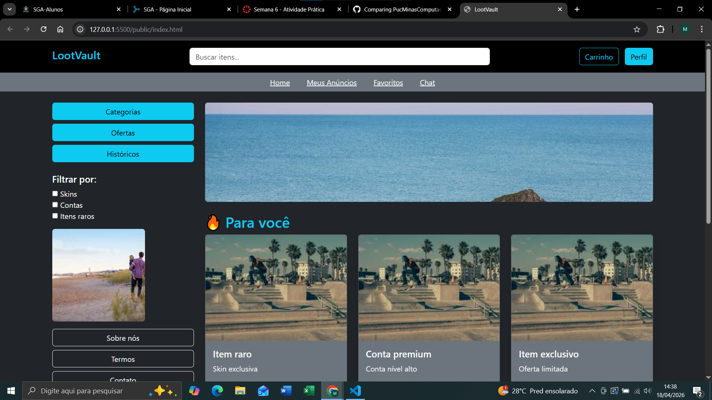
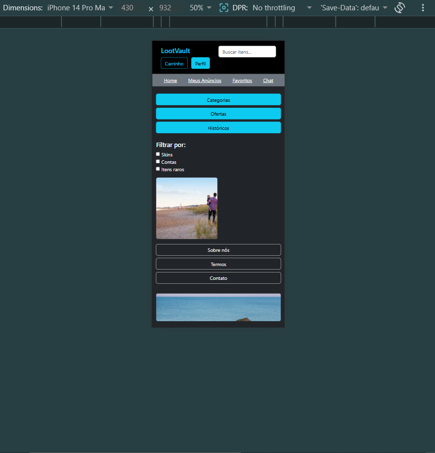

# Trabalho Prático - Semana 6

# LootVault - Home Page Responsiva com Bootstrap

## 📌 Descrição
Este projeto consiste na refatoração de uma home-page responsiva utilizando o framework Bootstrap, substituindo o uso de CSS puro (flexbox, grid e media queries).

## 🚀 Tecnologias utilizadas
- HTML5
- CSS3
- Bootstrap
- Git e GitHub

## 📱 Responsividade
O site foi desenvolvido para se adaptar a diferentes dispositivos:

- 💻 Desktop: layout com múltiplas colunas
- 📱 Mobile: layout em coluna única

## 📸 Prints do Projeto

### 💻 Versão Desktop

### 📱 Versão Mobile

## 👨‍💻 Autor
Mateus Evaristo Melo 